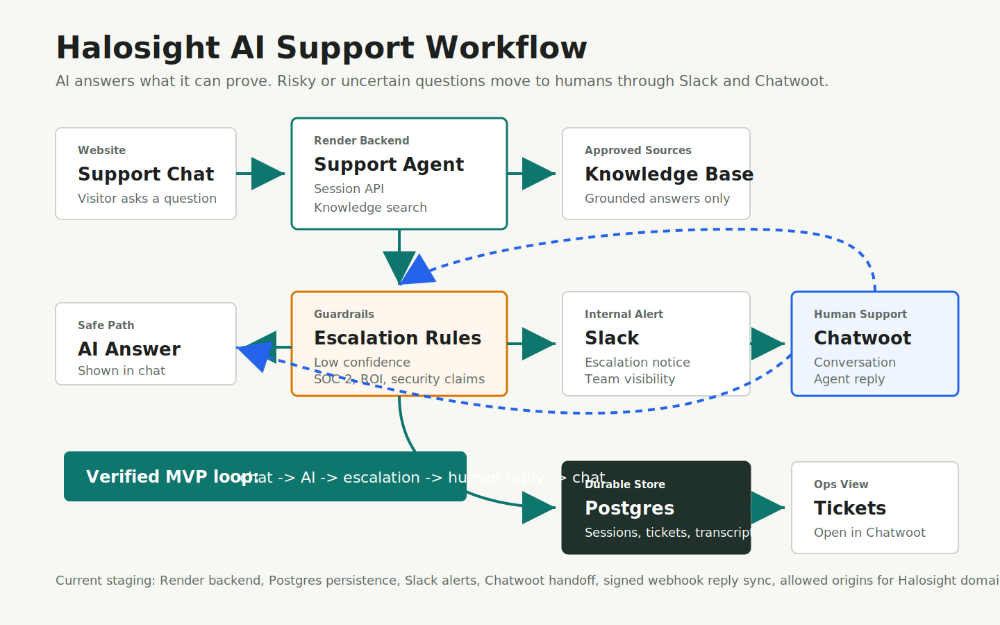

# CTO Demo Checklist

## Purpose

This checklist is for a short CTO review of the Halosight AI Support Agent MVP.

The demo should prove the working loop:

```text
Website chat -> AI support agent -> safe answer or escalation -> Slack + Chatwoot -> human reply -> chat
```



## Demo Links

Staging support chat:

```text
https://halosight-support-mvp.onrender.com/chat-client
```

Support ticket queue:

```text
https://halosight-support-mvp.onrender.com/tickets-view
```

Safe config check:

```text
https://halosight-support-mvp.onrender.com/debug/config
```

GitHub checkpoint:

```text
https://github.com/tmott-oss/HaloSupport/blob/main/docs/architecture/support-escalation-checkpoint.md
```

## Five-Minute Demo Script

### 1. Show The Chat Surface

Open:

```text
https://halosight-support-mvp.onrender.com/chat-client
```

Explain:

- this is the hosted support chat client
- it is the first surface for future Halosight.com embedding
- it talks to the support backend on Render

### 2. Ask A Normal Question

Send:

```text
What does Halosight do?
```

Expected result:

- the agent answers from approved Halosight knowledge
- no escalation is triggered
- the chat input clears after successful send

Talking point:

```text
The agent answers only from approved source material. It is intentionally conservative.
```

### 3. Ask A Restricted Question

Send:

```text
Can we tell a customer Halosight is SOC 2 certified and guarantees ROI?
```

Expected result:

- the agent refuses to make the unsupported claim
- the response is marked escalated
- Slack receives an internal escalation alert
- Chatwoot receives a real conversation
- a support ticket appears in the ticket queue

Talking point:

```text
The important behavior is not just answering. It knows when not to answer.
```

### 4. Show Chatwoot Handoff

Open the created Chatwoot conversation.

Confirm:

- the contact was created
- the conversation is open
- the transcript/context appears in Chatwoot
- the escalation reason is visible

Send a normal public Chatwoot reply:

```text
Thanks for reaching out. I’m checking this with the team and will follow up shortly.
```

Expected result:

- the reply appears back in the Halosight chat window as a `Support` message

Talking point:

```text
Humans work in Chatwoot. Customers stay in the Halosight chat experience.
```

### 5. Show Ticket Queue And Persistence

Open:

```text
https://halosight-support-mvp.onrender.com/tickets-view
```

Confirm:

- ticket is listed
- transcript is visible
- ticket has an `Open in Chatwoot` link
- status can be updated

Explain:

- sessions, transcripts, tickets, and Chatwoot links are persisted in Postgres
- this was verified by redeploying Render and confirming the ticket survived

### 6. Show Safe Config

Open:

```text
https://halosight-support-mvp.onrender.com/debug/config
```

Confirm:

- `persistence` is `postgres`
- `databaseConfigured` is `true`
- Chatwoot is configured
- Slack webhook shape is valid
- allowed origins are configured

Do not expose secret values during the demo.

## What Is Verified

- Render backend is live
- React chat client works
- knowledge-grounded answer path works
- restricted-claim escalation works
- Slack escalation works
- real Chatwoot conversation creation works
- signed Chatwoot webhook reply sync works
- human replies appear back in the chat
- support ticket queue works
- tickets link to Chatwoot
- Postgres persistence works
- tickets survive Render redeploy
- allowed origins are configured for Halosight-owned domains
- chat input clears after successful send

## What Is Still MVP

- no real LLM call yet
- keyword search is simple
- public-site knowledge needs stricter final curation
- support widget packaging is not final
- authenticated app context is not wired yet
- production monitoring is minimal
- Postgres needs backup, retention, and migration policy
- Chatwoot should remain the human-support source of truth

## Recommended Next Steps

1. Approve the current architecture for continued staging validation.
2. Add a controlled Halosight.com `/support` test page using the iframe or link option.
3. Finalize public-site support knowledge boundaries.
4. Add monitoring for Slack, Chatwoot, and webhook delivery failures.
5. Decide whether Slack remains as a parallel escalation notification after Chatwoot is operational.
6. Plan the production widget package after the hosted page test is accepted.

## One-Sentence Summary

Halosight now has a working AI-first support MVP that answers from approved knowledge, escalates risky questions, creates a Chatwoot handoff, syncs human replies back to the chat, and persists support history in Postgres.
